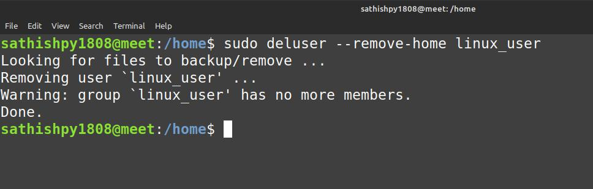

# deluser
- deluser - remove a user or group from the system

To delete an user account
```
$ sudo deluser user_name
```
To delete or account including deleting home directory
```
$ sudo deluser --remove-home user_name
```
To delete account even while the user logged in
```
$ sudo deluser --force <user_name>
```

## Screenshot

