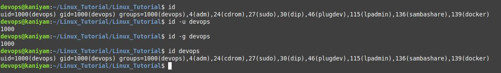

## id
*******
id - print real and effective user and group IDs
To print your own id without any options
```
id
```
To find a specific users id
```
id -u <user_name>
```
To find a specific users GID
```
id -g <user_name>
```
To find out UID and all groups associated with a username
```
id <user_name>
```
## Screenshot
**************


