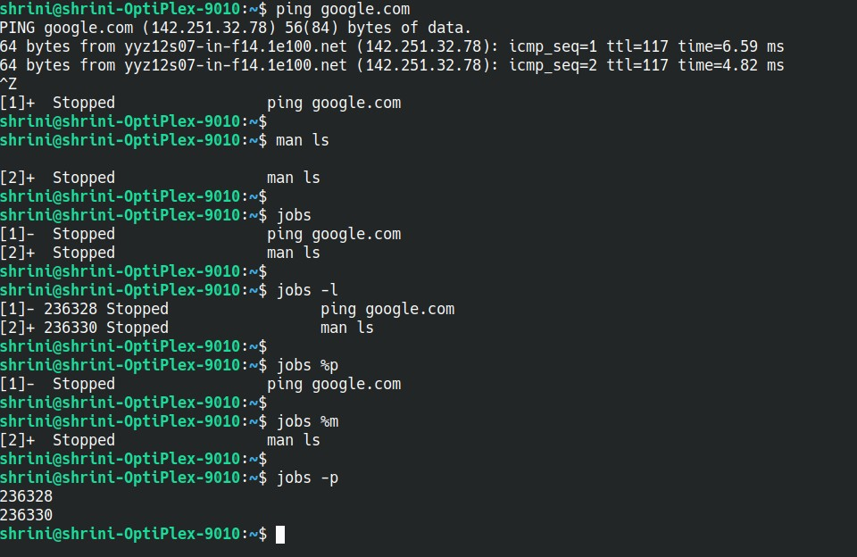

## jobs

jobs - used to list the jobs running in the background

To run some jobs in background

```
ping google.com
ctrl + z
```


```
man ls
ctrl + z
```

To lists jobs running in background

```
jobs
```


To display jobs with process id

```
jobs -l
```


To display the process ID or jobs for the job whose name
begins with “p” and “m”

```
jobs %p
jobs %m
```

To display PIDs only
```
jobs -p
```

### Screenshot


