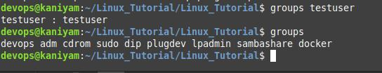

## groups
***********
groups - print the groups a user is in
```
groups [username]
```
To display group membership for the current user
```
groups
```
To find groups of root
## Screenshot
*************

