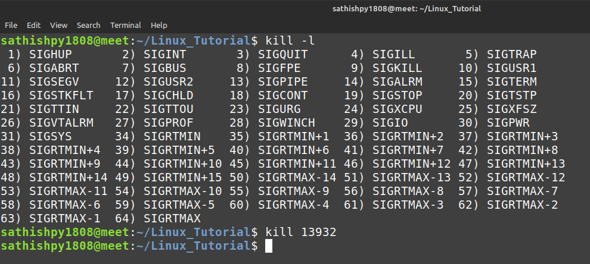

#kill

which is used to send a SIGNAL to a process

To display all the available signals
```
$kill -l
```

To use PID with the kill command
```
$kill PID
```

To kill multiple processes at once
```
$kill <pid1> <pid2> <pid3>
```

To forcefully kill single process
```
$ kill -9 <pid>
```

To forcefully kill multiple process
```
$ kill -9 <pid1> <pid2>
```

To find signal name
```
$ kill -l 3
$ kill -l 9
$ kill -l 15
```

## Screenshot


