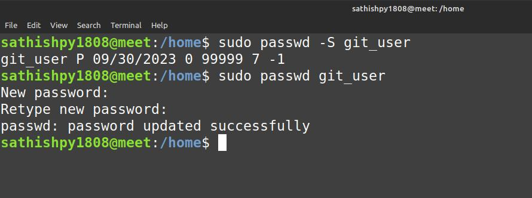

# passwd
 - passwd - change user password

To change system user’s password
```
$ passwd
```
To change password for root
```
$ sudo passwd root
```
To display user status Information
```
$ sudo passwd -S <user_name>
```
To display information of all users
```
$ sudo passwd -Sa
```

## Screenshot

