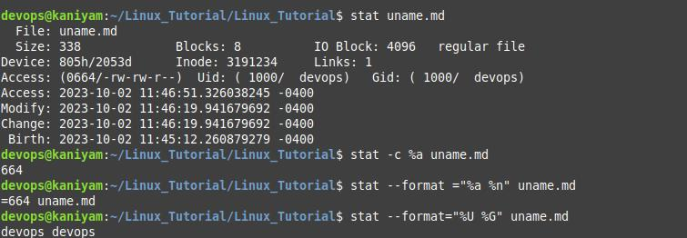

## stat
*********
stat - display file or file system status
To view the file details
```
stat file.txt
```
To Show only octal file permissions
```
stat -c %a file.txt
stat --format="%a %n" file.txt
```
To Show the owner and group of a file
```
stat --format="%U %G" file.txt
```
## Screenshot
***************


