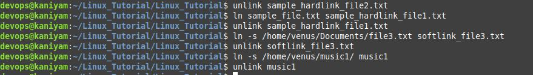

## unlink
**********

unlink - call the unlink function to remove the specified
file

syntax

```
unlink filename
unlink dir_name
```
To create hard link with the name sample_link_file.txt

```
ln sample_file.txt sample_hardlink_file1.txt
```
To delete the hardlink
```
unlink sample_hardlink_file1.txt
```
To create symbolic or soft link to a file
```
ln -s /home/venus/Documents/file.txt softlink_file.txt
```
To delete the symbolic link

```
unlink softlink_file.txt
```
To delete the symbolic link for directory

```
ln -s /home/venus/music/ music
unlink music
```
## Screenshot
***************

