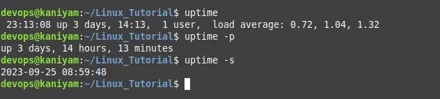

## uptime

*********
uptime -It tells how long the system has been running

uptime command without any options

`````
uptime

`````
To show uptime in pretty format

``````
$ uptime -p

``````
To display the date/time since when the system has been
running

``````
uptime -s

```````
## Screenshot
*******


