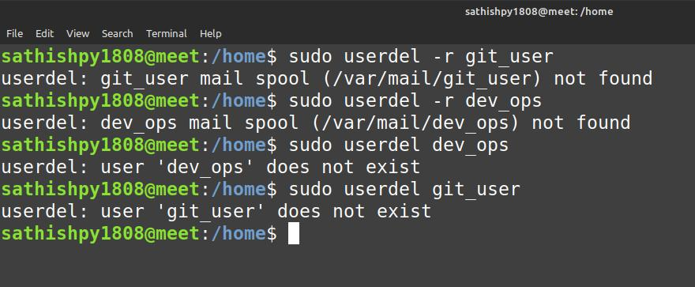

# userdel
 - userdel - delete a user account and related files

To delete a user account
```
$ sudo userdel user_name
```
To remove the user’s home directory and mail spool
```
$ sudo userdel -r user_name
```
To forcefully remove the user account
```
$ sudo userdel -f user_name
```

## Screenshot

