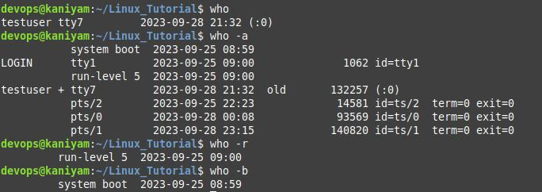

##  who
********

who - show who is logged on
To print who command output without options

``````
who

`````
To print same as -b -d --login -p -r -t -T -u

``````` 
who -a

``````
To check the current runlevel

``````

who -r

``````
To view the time of last system boot

`````
who -b

`````

## Screenshot

